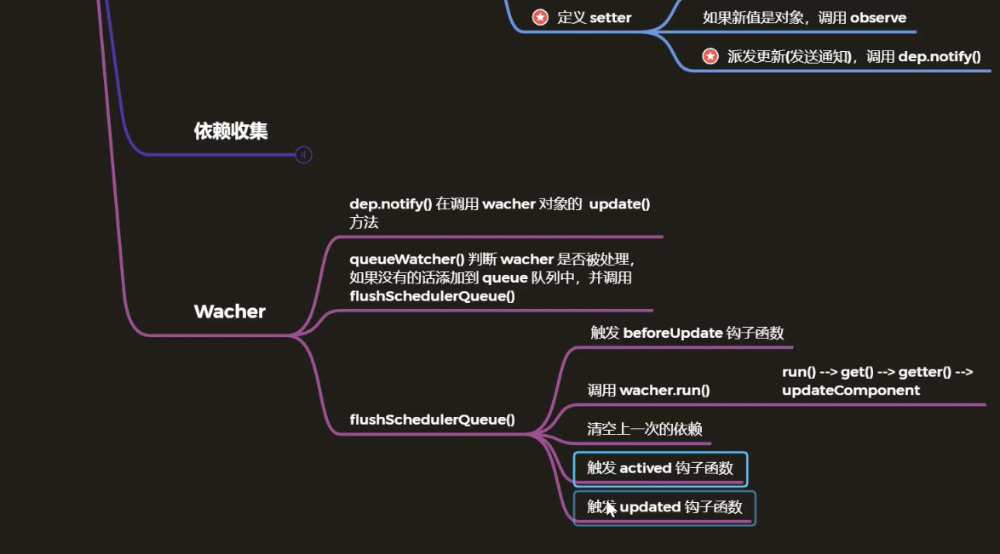

# 任务一：响应式原理（大部分参考pdf，此处作补充）
## 1. 课程目标
- vue.js的静态成员和实例成员初始化过程
- 首次渲染的过程
- **数据响应式原理**

## 2. 准备工作-目录结构

## 10. Vue实例化-实例成员
1. 不可以直接对`$data`和`$props`直接赋值
   ```js
   	// 03-02-study-materials/03-02-codes/vue/src/core/instance/state.js 345行
		export function stateMixin (Vue: Class<Component>) {
		// flow somehow has problems with directly declared definition object
		// when using Object.defineProperty, so we have to procedurally build up
		// the object here.
		const dataDef = {}
		dataDef.get = function () { return this._data }
		const propsDef = {}
		propsDef.get = function () { return this._props }
		if (process.env.NODE_ENV !== 'production') {
			dataDef.set = function () {
				warn(
					'Avoid replacing instance root $data. ' +
					'Use nested data properties instead.',
					this
				)
			}
			propsDef.set = function () {
				warn(`$props is readonly.`, this)
			}
		}
		Object.defineProperty(Vue.prototype, '$data', dataDef)
		Object.defineProperty(Vue.prototype, '$props', propsDef)

		Vue.prototype.$set = set
		Vue.prototype.$delete = del
		...
		}
   ```

	 ## 21. 数据响应式原理-数组
	 参考`vue/src/core/observer/array.js`

	 ## 27. 数据响应式原理-总结
	 

	 

	 

	 
	 
	 